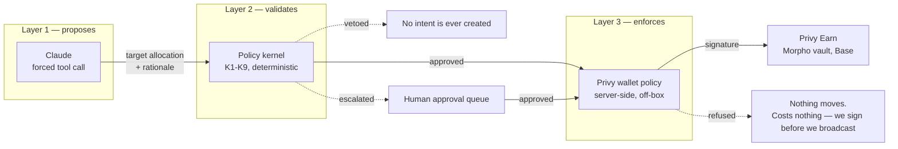
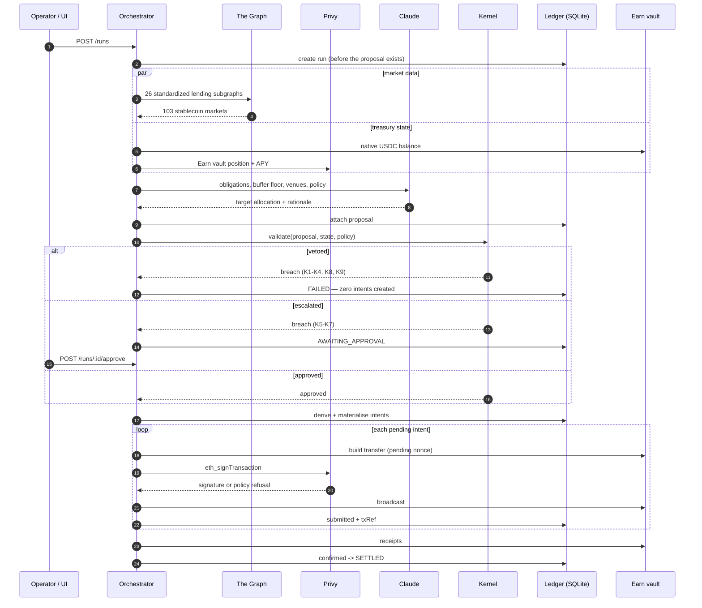
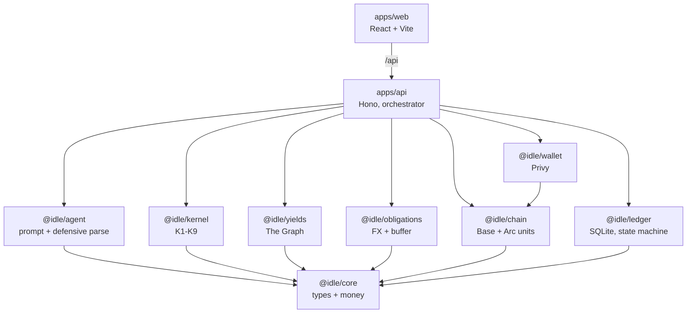
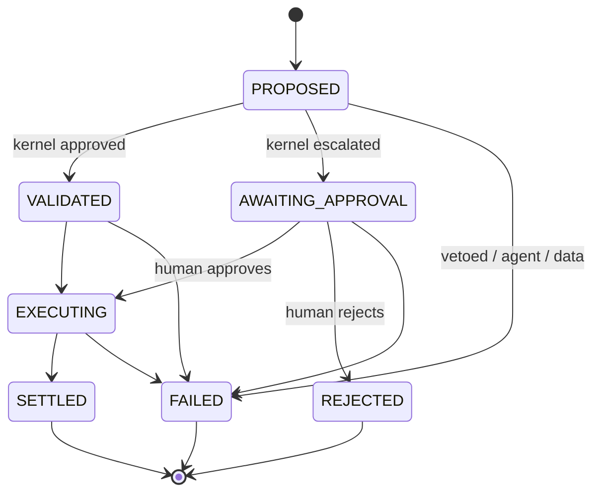
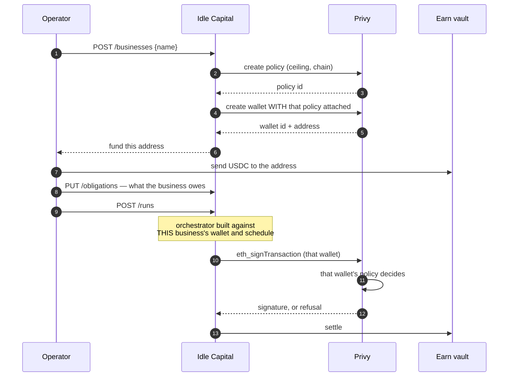

# Architecture

Idle Capital decides how much of a business's working capital must stay liquid
against forward obligations, and where the surplus goes. It reads live lending
rates from The Graph, proposes an allocation with a language model, validates
that proposal against a deterministic policy kernel, and deposits the result
through a policy-bound Privy wallet into a Morpho vault on Base.

This document describes how it is built and why. Decisions carrying a `D-0NN`
reference are recorded in [`DECISIONS.md`](../DECISIONS.md).

---

## 1. The problem

A twenty-person business trading across Nigeria, Kenya, Ghana and Tanzania
holds USDC and owes money in NGN, KES, GHS and TZS. Payroll, suppliers and rent
fall due on known dates. Holding everything liquid earns nothing; parking too
much means a payroll that cannot be met.

The decision has to be made repeatedly, against rates that change, and it has
to be **auditable** — a treasury cannot act on reasoning nobody can inspect,
and it cannot act on reasoning nobody can override.

---

## 2. The three-layer decision core

The central design decision (D-006). A language model is good at weighing a
messy situation and explaining itself, and unfit to be the last thing standing
between a business and its payroll. So it is never the last thing.

Each layer distrusts the one above it:

| Layer | Trusts | Can be bypassed by | Backstopped by |
|---|---|---|---|
| Agent | nothing — its output is parsed defensively | — | kernel |
| Kernel | the operator's policy | a bug that skips validation, a compromised orchestrator | wallet policy |
| Wallet policy | nothing on this machine | nothing we control | — |

The wallet policy is the only layer that survives total compromise of this
codebase, which is why the ceilings are deliberately unequal: the kernel caps
movement per run at 8 USDC, the wallet caps value per transaction at 10 USDC.
Outer bound above inner bound is the only ordering where both mean something
(D-015). It has refused a real transaction in this repo's history.

---

## 3. One run, end to end

Two orderings in that diagram are load-bearing:

**Market data is fetched before the agent is asked anything.** A Graph failure
costs one HTTP round trip and asks the model nothing. It also means the market
set the kernel validates against (K3) is the set from *this* run, not a cache.

**The run row is created before the proposal exists.** A failure in market
fetch, treasury read or the agent call is still a recorded run with a reason,
not a silent nothing. Every failure path writes an `error` string — added after
a live run returned a bare `FAILED` and told us nothing. The very next run
diagnosed itself.

---

## 4. Package map

| Package | Responsibility | Key decision |
|---|---|---|
| `@idle/core` | Types and money primitives. `bigint` minor units, ratios in basis points, `divCeil` and `applyBpsCeil` round **up** | Under-reserving is the unsafe direction, so every conversion rounds against us |
| `@idle/obligations` | Fixed FX table, buffer requirement, per-currency schedule | `confidence` never scales the amount — a 10%-likely payroll still needs the cash on the day |
| `@idle/yields` | 26 Messari standardized lending subgraphs, one query document, normalization | Fails closed on Graph errors; no fixtures, no cache (D-007). Quorum of 5 protocols or the run fails (D-009) |
| `@idle/kernel` | K1–K9, veto/escalate split | Vetoes evaluated first and win outright. The whole validator is wrapped so a throw degrades to a veto |
| `@idle/agent` | Prompt construction, forced tool schema, defensive parse | Returns `null` for anything unusable rather than repairing it |
| `@idle/ledger` | SQLite run/intent store, state machine, reconciliation | Money stored as TEXT, not INTEGER — 2^53 is not enough |
| `@idle/chain` | Base USDC reader (6dp, no scaling) and the Arc client it replaced (native USDC, 18dp, scaled by 10^12). Both kept because the unit difference is the trap: the same asset, the same name, different decimals | Each client owns its own conversion, behind one structural seam |
| `@idle/wallet` | Privy server wallet, policy, Earn vault | Signs *before* broadcasting, so a policy refusal costs nothing (D-014) |
| `apps/api` | Orchestrator, ports, HTTP | Every port is real in `server.ts`; the fakes live only in tests |
| `apps/web` | Ledger-sheet UI | Restructured so the refusal is the headline, not row 47 (D-013); rebuilt again around the decision rather than the machinery (D-023) |
| `@idle/wallet` (provisioner) | Onboards a business: policy, then wallet born with it attached | No tenant wallet exists unguarded, even briefly (D-021) |

---

## 5. The policy kernel

Eight invariants. Five veto, three escalate. The split is not about severity —
it is about **who can legitimately overrule it**.

| # | Invariant | Verdict | Why that verdict |
|---|---|---|---|
| K1 | Retained balance covers obligations × buffer multiplier | **VETO** | Nobody may approve missing payroll |
| K2 | `hold` + allocations equal the treasury exactly | **VETO** | Money that does not conserve is a bug, never a judgement call |
| K3 | Every named market exists in **this run's** live set | **VETO** | An allocation into a market that no longer exists is a transfer into nothing |
| K4 | Every venue sits on an allowlisted protocol | **VETO** | The operator's authorisation is not the agent's to widen |
| K5 | No venue holds more than 50% of parked capital | ESCALATE | Concentration is a risk appetite question — a human may accept it |
| K6 | Churn this run is under the movement ceiling | ESCALATE | Bounds the blast radius of one bad decision, whoever made it |
| K7 | Every target venue is above the liquidity floor | ESCALATE | Yield on capital you cannot withdraw is not yield |
| K9 | Every target venue earns ≥ `minNetYieldBps` over the buffer horizon | **VETO** | K1–K8 all passed a proposal that parked capital at 0.003% APY against a 0.005 USDC round trip. None of them asked whether the trade was worth making (D-025) |
| K8 | The proposal is structurally well-formed | **VETO** | Takes `unknown` deliberately — TypeScript types are erased at runtime |

Three properties worth stating explicitly:

**Vetoes win outright.** They are evaluated first, and a vetoed proposal creates
zero intents. Escalation is not a weaker veto; it is a different question.

**K6 measures churn, not size.** Under target semantics (D-011), a proposal that
changes nothing still names the full position. Charging that against the
movement cap would block every no-op rebalance.

**K3 is why there is no market cache.** The proposal is checked against markets
fetched in the same run. A cached list would let the kernel approve an
allocation into a venue that disappeared between runs.

---

## 6. Run and intent state machines

Transitions are enforced, not conventional: `transitionRun` throws
`IllegalTransitionError` on anything not in the table. Terminal states are
terminal — a `FAILED` run cannot be rejected, resumed or retried into life.

Intents move `pending → submitted → confirmed | failed`, each carrying an
idempotency key of `{runId}:{seq}`.

**The key excludes the amount, deliberately.** A retry that recomputed a
slightly different figure would otherwise mint a *new* key and submit a second
transfer. Intent derivation is deterministic — market ids sorted, withdrawals
before deposits — so a crash and resume recompute exactly the same sequence
with exactly the same keys.

### Crash safety

`reconcile()` runs before the server accepts any request. It inspects every
in-flight intent and **never calls `submit`** — it can only ask the chain what
already happened. A port that throws leaves the intent in flight rather than
resolving it optimistically.

This is proved by a property test that crashes mid-run and asserts exactly one
broadcast survives the resume. It has also proved itself in production: a run
interrupted by a nonce collision left an intent in flight, and the next startup
reported `{ checked: 1, confirmed: 1, failed: 0, stillPending: 0 }` without
resubmitting anything.

---

## 7. Money discipline

No float ever touches money.

- Amounts are `bigint` in **minor units** (USDC has 6 decimals; `1_000_000n` is
  one dollar).
- Ratios are **basis points** as integers — `11_500` is 115%.
- Every conversion rounds **up**, via `divCeil`. Under-reserving is the unsafe
  direction, so the rounding error is always in the treasury's favour.
- SQLite stores amounts as `TEXT`. `INTEGER` is a 64-bit signed value that
  JavaScript reads back through a `number`, and 2^53 is not enough headroom to
  be careless with.
- The frontend formats string-in, string-out and never calls `Number` — pinned
  by a test on `9007199254740993`.

The agent is not exempt: it is given the hold floor and the deployable ceiling
as **finished numbers**, computed with the same `applyBpsCeil` the kernel
validates against. Asking it to multiply a buffer by 11,500 basis points and
round up cost a live run a veto for a 450-minor-unit shortfall (D-017).

---

## 8. Data sources, and the seams

Every rate in this system is live. Some other things are not, and this section
is the complete list.

| Source | Live? | Notes |
|---|---|---|
| Lending rates and liquidity | **Live** | 26 Messari standardized subgraphs on The Graph's decentralized network, queried per run. No fixtures, no cache, no fallback |
| Earn vault APY, liquidity, position | **Live** | Privy Earn API |
| Treasury balance | **Live** | USDC on Base mainnet, read from the token contract |
| Deposit / withdrawal | **Live** | Privy Earn into Steakhouse Prime USDC (Morpho, Base). Real USDC |
| **FX rates** | **Fixed table** | Documented in `packages/obligations/src/fx.ts` with an `asOf` date and a `source` string surfaced in the UI. Swapping in an oracle means replacing one object |
| **Obligations** | **Fixture** | Company data — there is no feed to read it from, and every treasury system takes it as input. Two schedules ship: the business's real one, and a 1/2000 testnet scaling (D-020) |
| **Venue reachability** | **One venue** | 104 markets are compared; one can be deposited into. The rest are the opportunity-cost benchmark K9 measures against, not destinations |

The Graph layer fails **closed** (D-007). If the gateway errors, or fewer than
five protocols answer, the run fails rather than proceeding on partial data. A
treasury that quietly reasons over half the market is worse than one that stops.

### rari-fuse is in the registry on purpose

It was exploited and abandoned in 2022. Its subgraph still answers. It still
reports the highest yield in the set — **12,728,198.58% APY on negative
liquidity** in a live run through this API.

Sorting live yield data by yield puts it first. That is not a hypothetical the
kernel guards against; it is what the data does every single time. K4 and K7 are
load-bearing because of it (D-010), and it is why the prompt shows the agent
forbidden venues rather than hiding them — an agent that never sees rari-fuse
has not declined it.

It also caused the subtlest bug in this repo. The prompt originally showed the
top 25 markets by rate; on live data **none of the eight allowlisted markets
reached the cut**, and the agent correctly reported that nothing was fundable.
A sort had silently decided what the agent was allowed to consider (D-018).

---

## 9. Failure modes

| Failure | Behaviour |
|---|---|
| Graph gateway down, or quorum not met | Run FAILED with the reason. Nothing is asked of the agent |
| Agent unreachable, out of credit, or truncated | Run FAILED with `stop_reason` named; truncation is reported distinctly from a malformed payload |
| Agent proposes something unsafe | Kernel vetoes; zero intents created |
| Agent proposes something aggressive | Kernel escalates; waits for a human |
| Human approves past the kernel ceiling | Privy wallet policy refuses the signature. Nothing broadcasts, nothing is spent |
| Process dies mid-run | Startup reconciliation confirms what settled and resubmits nothing |
| Two intents in one run | Distinct pending nonces; both settle |
| Ledger directory missing on first boot | Created. Found by running the README as written |

---

## 10. HTTP surface

| Method | Path | Purpose |
|---|---|---|
| `GET` | `/health` | Liveness |
| `GET` | `/policy` | The active policy, bigints as strings |
| `GET` | `/markets` | The live market set every run reasons over |
| `POST` | `/businesses` | Onboard — provisions a wallet, returns an address to fund |
| `GET` | `/businesses` | Every business |
| `GET` | `/businesses/:id` | One business: treasury, schedule, runs |
| `PUT` | `/businesses/:id/obligations` | Replace the forward schedule |
| `POST` | `/businesses/:id/fund` | Answers 501. Mainnet has no faucet; the response names the address to send USDC to |
| `POST` | `/businesses/:id/runs` | Start a run for that business |
| `GET` | `/businesses/:id/runs` | That business's runs, and no other's |
| `GET` | `/runs/:id` | One run with its intents |
| `POST` | `/runs/:id/approve` | Approve an escalated run |
| `POST` | `/runs/:id/reject` | Reject an escalated run; moves no money |

Every run lives under a business. There is no unscoped `POST /runs`, because
there is no ambient treasury for it to act on.

---

## 11. Tenancy

A business is the unit of everything: one business, one wallet, one schedule,
one set of runs.

**The policy is created before the wallet, and attached at creation.** Creating
a wallet first and guarding it afterwards leaves a window in which a funded
tenant wallet will sign anything — and onboarding is precisely when an address
is being watched. Proven, not assumed: a freshly provisioned wallet refuses a
signature over its ceiling (`specs/spikes/2026-09-11-tenant-provisioning-spike.md`).

**Isolation lives in the query, not in a convention.** `depsFor(business)`
builds the orchestrator against one business's wallet and one business's
obligations; there is no module-level treasury to reach past it. Tests assert
the isolation in both directions — neither business reads the other's
obligations, and replacing one schedule leaves the other alone.

**Obligation ids belong to the business.** "sep-payroll" is a label two
customers will both use, so the key is composite. Keyed globally, the second
customer to save a schedule got a constraint violation.

### Where parked capital lives

A deposit moves USDC out of the wallet into the vault, so a balance read alone
would show a business as *poorer* after every approved run, and K2's
conservation check would never balance. Positions are therefore derived from
the business's own confirmed intents — deposits add, withdrawals subtract —
which is what a treasury system's books are for.

When the Earn vault reports a real position for that wallet it takes
precedence: the venue's own answer beats ours. On testnet it reports nothing.
The UI splits **liquid** from **committed** and says plainly that the
vault-side deposit is a mainnet step this deployment does not take, rather than
implying a yield nobody is collecting.

---

## 12. What is deliberately absent

- **No market cache.** K3 depends on freshness (§5).
- **No retry loop around the agent.** A failed run is a recorded fact; the
  operator starts another. Automatic retries against a paid API with money at
  the end are a way to spend both without noticing.
- **No private key, anywhere.** Privy signs every movement (D-014). The one key
  this repo ever used belonged to the Arc faucet, and that faucet is gone with
  the chain it funded — mainnet has no tap, so funding is an operator action and
  the code holds no secret that can move money.
- **No authentication.** Anyone who reaches the API can open any business. A
  demo, and disclosed as one: tenancy here is about isolating treasuries from
  each other's decisions, not about defending them from an attacker who already
  has the URL. Real deployment puts auth in front of `/businesses/:id`.
- **No fiat rails.** Cut on day one against a compressed week (D-005), and
  disclosed as cut rather than quietly descoped.
